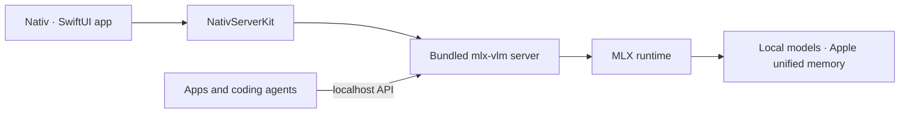

<p align="center">
  
</p>

<h1 align="center">Nativ</h1>

[English](README.md) | [简体中文](README.zh-CN.md) | [日本語](README.ja.md)

<p align="center">
  <strong>Mac でネイティブに動作するローカル AI。</strong>
</p>

<p align="center">
  1 つの macOS アプリで MLX モデルとのチャット、提供、監視、接続を行えます。
</p>

<p align="center">
  
  
  
  
</p>

Nativ は、Apple シリコン上で AI モデルをローカル実行するためのネイティブ macOS ワークスペースです。[`mlx-vlm`](https://github.com/Blaizzy/mlx-vlm) サーバーを同梱し、Hugging Face のキャッシュから互換性のあるモデルを検出して、洗練された SwiftUI アプリにすべての体験をまとめます。

Nativ は、プライベートなチャットアプリ、モデルマネージャー、パフォーマンスダッシュボードとして、また既存のツール向けに OpenAI および Anthropic と互換性のあるローカル推論サーバーとして利用できます。

## Nativ でできること

| 機能 | 提供されるもの |
|---|---|
| **ローカルチャットとビジョン** | ストリーミング会話、画像添付、推論出力、レスポンス指標、永続的なチャット履歴。 |
| **モデルライブラリ** | インストール済み MLX モデルの検出、Hugging Face 上の互換モデルの閲覧とダウンロード、機能の確認、モデルの切り替え、古いモデルの削除。 |
| **パフォーマンス分析** | リクエスト数、token 使用量、最初の token までの時間、デコード速度、モデル性能、最近のアクティビティの追跡。 |
| **ローカル API** | OpenAI 互換のチャット、Responses、画像、音声、モデルの各エンドポイント、および Anthropic Messages 互換エンドポイント。 |
| **コーディングツール連携** | Nativ が提供するモデルに対して Codex、Claude Code、Pi、Hermes、OpenCode を設定して起動。 |
| **開発者ワークスペース** | ランタイムの詳細確認、エンドポイント URL のコピー、ライブサーバーログの検索と絞り込み、サーバー状態の監視。 |
| **メニューバー操作** | サーバーの起動と停止、読み込むモデルの変更、提供状況の確認、作業の流れを中断せずにメインアプリを開く操作。 |
| **高度な推論制御** | サンプリング、思考予算、構造化出力、KV キャッシュ量子化、プレフィックスキャッシュ、投機的デコーディングの調整。 |

モデルをダウンロードすると、推論は Mac 上で実行されます。モデルのダウンロードと初回ビルド用の依存関係には、引き続きネットワーク接続が必要です。

## 近日公開

音声専用モデルと画像生成専用モデルへの対応を予定しています。

## 仕組み



`NativServerKit` は、組み込み Python ディストリビューションとサーバーのライフサイクルを管理します。アプリはそのランタイムを中心に、モデル検出、チャット、分析、設定、連携、ログ、メニューバー操作、ソフトウェア更新を追加します。

## 要件

アプリの実行に必要なもの：

- Apple シリコン搭載 Mac。
- macOS 26 以降。
- 選択したモデルに十分な統合メモリ。

ソースからビルドする場合は、さらに以下が必要です：

- macOS 26 SDK を含む Xcode。
- [`xcodegen`](https://github.com/yonaskolb/XcodeGen)。
- Python 3。
- 組み込み Python バンドルを初めて構築または更新する際に、GitHub Releases と PyPI にアクセスできるネットワーク接続。

## はじめに

### リリースをダウンロード

[GitHub Releases](https://github.com/Blaizzy/nativ/releases/latest) から最新の DMG をダウンロードし、**Nativ** を「アプリケーション」フォルダへドラッグして起動します。以降のアプリ内更新には Sparkle が使用されます。

初回起動時：

1. インストール済みの言語モデルを選択するか、オンデマンド読み込みで続行します。
2. 必要に応じて API キーを生成し、サーバーの管理エンドポイントを保護します。
3. **Models** を開き、互換性のあるモデルをダウンロードまたは選択します。
4. チャットを開始し、分析を確認するか、対応するコーディングツールを接続します。

### ソースからビルド

```sh
brew install xcodegen
make xcode-generate
make xcode-build
open build/XcodeDerivedData/Build/Products/Debug/Nativ.app
```

初回ビルドでは、`NativServerKit` が再配置可能な Python ランタイムを作成し、バージョン固定された `mlx-vlm` サーバーの依存関係をフレームワークのリソースへインストールするため、時間がかかる場合があります。以降のビルドでは、入力が変更されるまでこのバンドルが再利用されます。

## Nativ をローカル API サーバーとして使用

デフォルトでは、アプリは `http://127.0.0.1:8080` でサーバーを公開します。Developer ページには利用可能なすべてのエンドポイントが表示され、URL を直接コピーできます。

たとえば、モデルを選択した状態で：

```sh
curl http://127.0.0.1:8080/v1/chat/completions \
  -H 'Content-Type: application/json' \
  -d '{
    "model": "your-model-id",
    "messages": [{"role": "user", "content": "Why is the sky blue?"}],
    "stream": false
  }'
```

サーバー API キーを有効にした場合は、Bearer token として送信します：

```sh
-H 'Authorization: Bearer your-api-key'
```

サーバーには以下が含まれます：

- OpenAI 互換の `/v1/chat/completions`、`/v1/responses`、`/v1/models`、画像、音声ルート。
- Anthropic 互換の `/v1/messages` と token カウントルート。
- `/health`、`/metrics`、キャッシュ統計、キャッシュリセット、モデルのアンロード用エンドポイント。

## プロジェクト構成

```text
Sources/
├── Nativ/                       # SwiftUI application
│   ├── Features/
│   │   ├── Chat/
│   │   ├── Dashboard/
│   │   ├── Developer/
│   │   ├── ImageGeneration/
│   │   ├── Integrations/
│   │   └── Models/
│   ├── Assets.xcassets/
│   ├── ModelProviderIcons/
│   └── Utilities/
└── NativServerKit/              # Embedded server and Swift clients
PythonDistribution/
├── Launcher/                    # Relocatable server launcher
├── Requirements/                # Pinned Python dependencies
└── Scripts/                     # Bundle assembly and verification
Configuration/                   # App metadata and signing settings
Design/                          # Brand source files and README artwork
scripts/                         # Archive, signing, notarization, and release tools
project.yml                      # XcodeGen project definition
```

## 開発

### ビルドとスモークテスト

Xcode プロジェクトを生成してビルドします：

```sh
make xcode-generate
make xcode-build
```

同梱の実行ファイルが起動し、`mlx_vlm.server` のヘルプを表示できることを確認します：

```sh
make xcode-smoke
```

長時間稼働するプロセスのライフサイクルと `/metrics` の準備状態をテストします：

```sh
make xcode-lifecycle-smoke
```

少数の実リクエストを生成し、実行前後の指標を比較するには、次を実行します：

```sh
scripts/run_metrics_queries.py
```

モデルのダウンロードと読み込みが行われるため、最初のリクエストには時間がかかる場合があります。

---

<p align="center">
  Apple シリコン上での高速なローカル推論のために構築されています。
</p>
