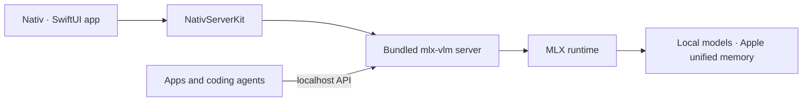

<p align="center">
  
</p>

<h1 align="center">Nativ</h1>

[English](README.md) | [简体中文](README.zh-CN.md) | [日本語](README.ja.md)

<p align="center">
  <strong>在 Mac 上原生运行的本地 AI。</strong>
</p>

<p align="center">
  在一个 macOS 应用中聊天、提供服务、监控并连接 MLX 模型。
</p>

<p align="center">
  
  
  
  
</p>

Nativ 是一个原生 macOS 工作空间，用于在 Apple 芯片上本地运行 AI 模型。它内置 [`mlx-vlm`](https://github.com/Blaizzy/mlx-vlm) 服务器，可查找 Hugging Face 缓存中的兼容模型，并通过精心设计的 SwiftUI 应用整合整个使用体验。

你可以将 Nativ 用作私密聊天应用、模型管理器、性能仪表板，或为现有工具提供兼容 OpenAI 和 Anthropic 的本地推理服务器。

## Nativ 的功能

| 功能 | 你将获得 |
|---|---|
| **本地聊天与视觉** | 流式对话、图片附件、推理输出、响应指标和持久化聊天记录。 |
| **模型库** | 发现已安装的 MLX 模型、在 Hugging Face 上浏览兼容模型、下载模型、检查模型能力、切换模型或删除旧模型。 |
| **性能分析** | 跟踪请求量、token 使用量、首个 token 延迟、解码速度、模型性能和近期活动。 |
| **本地 API** | 兼容 OpenAI 的聊天、Responses、图片、音频和模型端点，以及兼容 Anthropic 的 Messages 端点。 |
| **编程工具集成** | 配置并启动 Codex、Claude Code、Pi、Hermes 和 OpenCode，以使用 Nativ 提供服务的模型。 |
| **开发者工作空间** | 查看运行时详情、复制端点 URL、搜索和筛选实时服务器日志，并监控服务器健康状态。 |
| **菜单栏控制** | 启动或停止服务器、更改已加载的模型、查看服务统计信息，以及在不打断当前操作的情况下打开主应用。 |
| **高级推理控制** | 调整采样、思考预算、结构化输出、KV 缓存量化、前缀缓存和推测式解码。 |

模型下载完成后，推理将在你的 Mac 上运行。下载模型和首次构建所需的依赖项仍需要网络连接。

## 即将推出

即将支持专用的纯音频模型和纯图片生成模型。

## 工作原理



`NativServerKit` 管理嵌入式 Python 发行版和服务器生命周期。应用围绕该运行时提供模型发现、聊天、分析、配置、集成、日志、菜单栏控制和软件更新等功能。

## 系统要求

运行应用需要：

- 配备 Apple 芯片的 Mac。
- macOS 26 或更高版本。
- 足以运行所选模型的统一内存。

从源代码构建还需要：

- 包含 macOS 26 SDK 的 Xcode。
- [`xcodegen`](https://github.com/yonaskolb/XcodeGen)。
- Python 3。
- 首次组装或更新嵌入式 Python 包时，能够访问 GitHub Releases 和 PyPI 的网络连接。

## 开始使用

### 下载发行版

从 [GitHub Releases](https://github.com/Blaizzy/nativ/releases/latest) 下载最新的 DMG，将 **Nativ** 拖到“应用程序”文件夹并启动。后续应用内更新由 Sparkle 完成。

首次启动时：

1. 选择已安装的语言模型，或继续使用按需加载。
2. 可选择生成 API 密钥，以保护服务器的管理端点。
3. 打开 **Models** 下载或选择兼容模型。
4. 开始聊天、查看分析数据，或连接受支持的编程工具。

### 从源代码构建

```sh
brew install xcodegen
make xcode-generate
make xcode-build
open build/XcodeDerivedData/Build/Products/Debug/Nativ.app
```

首次构建可能需要一些时间，因为 `NativServerKit` 会创建可重定位的 Python 运行时，并将固定版本的 `mlx-vlm` 服务器依赖项安装到框架资源中。在输入内容发生变化之前，后续构建会重复使用该软件包。

## 将 Nativ 用作本地 API 服务器

默认情况下，应用会在 `http://127.0.0.1:8080` 提供服务器。Developer 页面列出了所有可用端点，并可让你直接复制 URL。

例如，在选择模型后：

```sh
curl http://127.0.0.1:8080/v1/chat/completions \
  -H 'Content-Type: application/json' \
  -d '{
    "model": "your-model-id",
    "messages": [{"role": "user", "content": "Why is the sky blue?"}],
    "stream": false
  }'
```

如果启用了服务器 API 密钥，还需要将其作为 Bearer token 发送：

```sh
-H 'Authorization: Bearer your-api-key'
```

服务器包括：

- 兼容 OpenAI 的 `/v1/chat/completions`、`/v1/responses`、`/v1/models`、图片和音频路由。
- 兼容 Anthropic 的 `/v1/messages` 和 token 计数路由。
- `/health`、`/metrics`、缓存统计、缓存重置和模型卸载端点。

## 项目结构

```text
Sources/
├── Nativ/                       # SwiftUI application
│   ├── Features/
│   │   ├── Chat/
│   │   ├── Dashboard/
│   │   ├── Developer/
│   │   ├── ImageGeneration/
│   │   ├── Integrations/
│   │   └── Models/
│   ├── Assets.xcassets/
│   ├── ModelProviderIcons/
│   └── Utilities/
└── NativServerKit/              # Embedded server and Swift clients
PythonDistribution/
├── Launcher/                    # Relocatable server launcher
├── Requirements/                # Pinned Python dependencies
└── Scripts/                     # Bundle assembly and verification
Configuration/                   # App metadata and signing settings
Design/                          # Brand source files and README artwork
scripts/                         # Archive, signing, notarization, and release tools
project.yml                      # XcodeGen project definition
```

## 开发

### 构建和冒烟测试

生成并构建 Xcode 项目：

```sh
make xcode-generate
make xcode-build
```

验证内置可执行文件能否启动并输出 `mlx_vlm.server` 帮助信息：

```sh
make xcode-smoke
```

测试长时间运行的进程生命周期和 `/metrics` 就绪状态：

```sh
make xcode-lifecycle-smoke
```

要生成少量真实请求并比较前后的指标，请运行：

```sh
scripts/run_metrics_queries.py
```

模型下载和加载期间，首次请求可能需要更长时间。

---

<p align="center">
  专为 Apple 芯片上的高速本地推理而构建。
</p>
